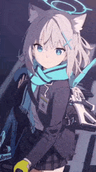

# Chat-With-Shiroko
<!doctype html>
<html lang="id">
<head>
<meta charset="utf-8" />
<meta name="viewport" content="width=device-width,initial-scale=1" />
<title>Shiroko Chat — LeafZuya</title>

</head>
<body>
  

    

      <!-- LEFT -->
      

        
Klik tombol di kanan untuk mulai ngobrol dengan Shiroko!

        

          <!-- Ganti src di bawah sesuai nama file GIF di repo (contoh: 'shiroko.gif' atau 'shiroko.png') -->
          
        

        
LeafCy

        
Teman Bicara! — Have Fun!

        

          <button class="btn primary" id="btnWave">Say Hello</button>
          <button class="btn" id="btnCalm">Hobimu?</button>
        

        

          <button class="btn" id="btnDance">Menari Lah!</button>
          <button class="btn" id="btnSleep">Good Night</button>
        

        
You can replace <b>shiroko.gif</b> with your own GIF file in the same repo.

      

      <!-- RIGHT -->
      

        
Interaksi Simpel Lanjutan Dengan LeafCy

        

          <button class="btn primary" id="btnStart">Start</button>
          <button class="btn" id="btnClear">Clear Chat</button>
          <button class="btn" id="btnAdd">Add Custom Reply</button>
        

        

          <!-- preset buttons generated by JS -->
        

        

        

          <input id="textIn" type="text" placeholder="Ketik pesan (atau tekan salah satu tombol preset)..." />
          <button class="btn primary" id="btnSend">Send</button>
        

        
Tip: tombol preset memberikan jawaban cepat; kamu juga bisa menambah jawaban sendiri.

        
Dibuat Oleh❤️ — LeafZuya

      

    

  

</body>
</html>
