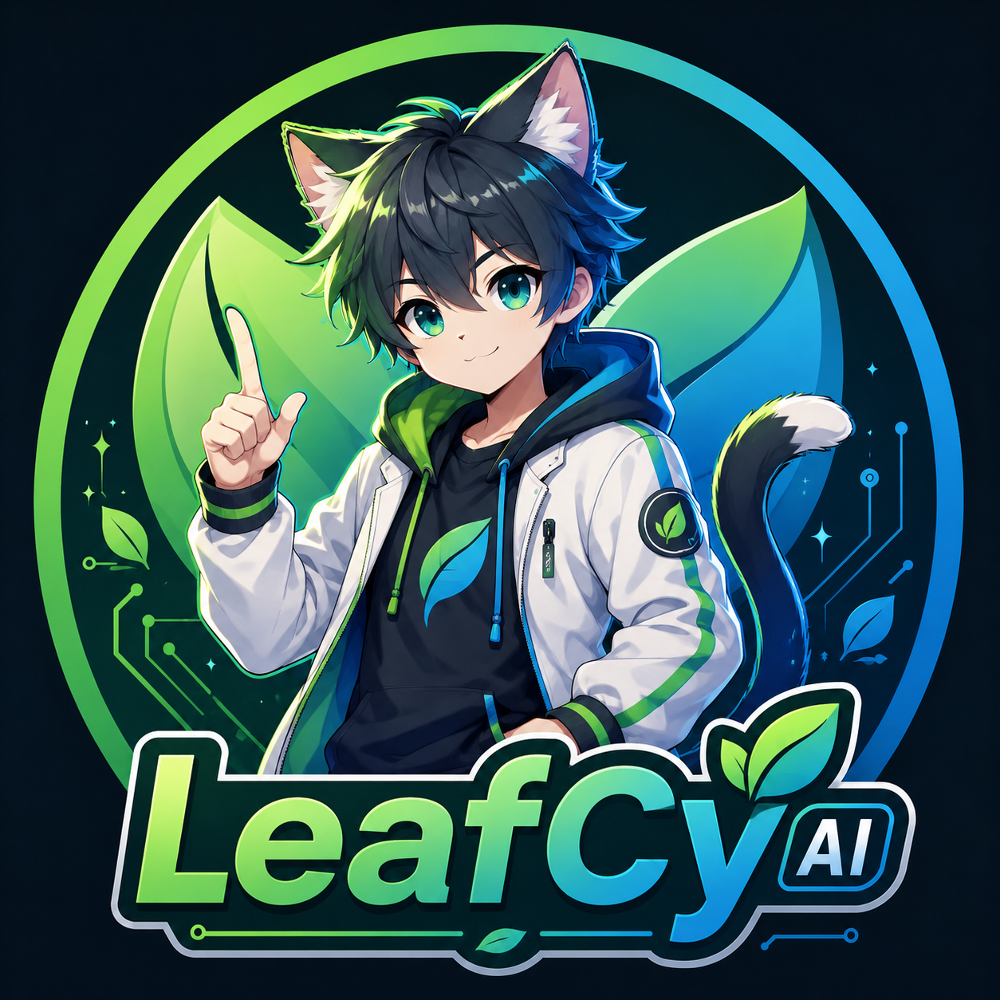

<html lang="id">
<head>
    <meta charset="UTF-8">
    <meta name="viewport" content="width=device-width, initial-scale=1.0, user-scalable=no">
    <meta name="google-site-verification" content="df6EtL6mKtOPWlg4bi57__R4cjbLIAuNwZisuD42fHo" />
    <title>LeafCy AI [New Beta] - Hapus Pesan Tanpa Hilangkan Ingatan AI</title>
    <!-- Google Fonts + Font Awesome -->
    <link href="https://fonts.googleapis.com/css2?family=Inter:opsz,wght@14..32,300;14..32,400;14..32,500;14..32,600;14..32,700&display=swap" rel="stylesheet">
    <link rel="stylesheet" href="https://cdnjs.cloudflare.com/ajax/libs/font-awesome/6.0.0-beta3/css/all.min.css">
    
</head>
<body>

    

        

            

                
            

            
LeafCy AI

            
<i class="fas fa-charging-station"></i> Zyrion (Leaf-Ice)

        

        

            
<i class="fas fa-history"></i> Riwayat

            
<i class="fas fa-robot"></i> AI Siap

        

    

    

        

            <i class="fas fa-seedling" style="font-size: 32px; margin-bottom: 10px; display: block; opacity: 0.7; color: #2ecc71;"></i>
            LeafCy with Zyrion (Leaf-Ice) 🎯 1 Juta Token Konteks | Bisa Baca Gambar! 📷
        

    

    

        

            <textarea id="chatInput" rows="1" placeholder="Tanya apa saja... AI akan merespon dengan logika Sendiri" aria-label="Chat"></textarea>
            <input type="file" id="fileInput" accept="image/*">
            <button class="upload-btn" id="uploadBtn"><i class="fas fa-image"></i></button>
            <button class="send-btn" id="sendBtn"><i class="fas fa-paper-plane"></i></button>
        

        

            
<i class="fas fa-microchip"></i> model: Zyrion (Leaf-Ice) (1M token)

            
<i class="fas fa-database"></i> Hapus pesan (hover) ✔️ AI tetap ingat konteks

        

    

    

        <h3><i class="fas fa-history"></i> Riwayat Chat</h3>
        <button class="close-sidebar" id="closeSidebar"><i class="fas fa-times"></i></button>
    

    

    <button class="new-chat-btn" id="newChatBtn"><i class="fas fa-plus-circle"></i> Chat Baru</button>

</body>
</html>
