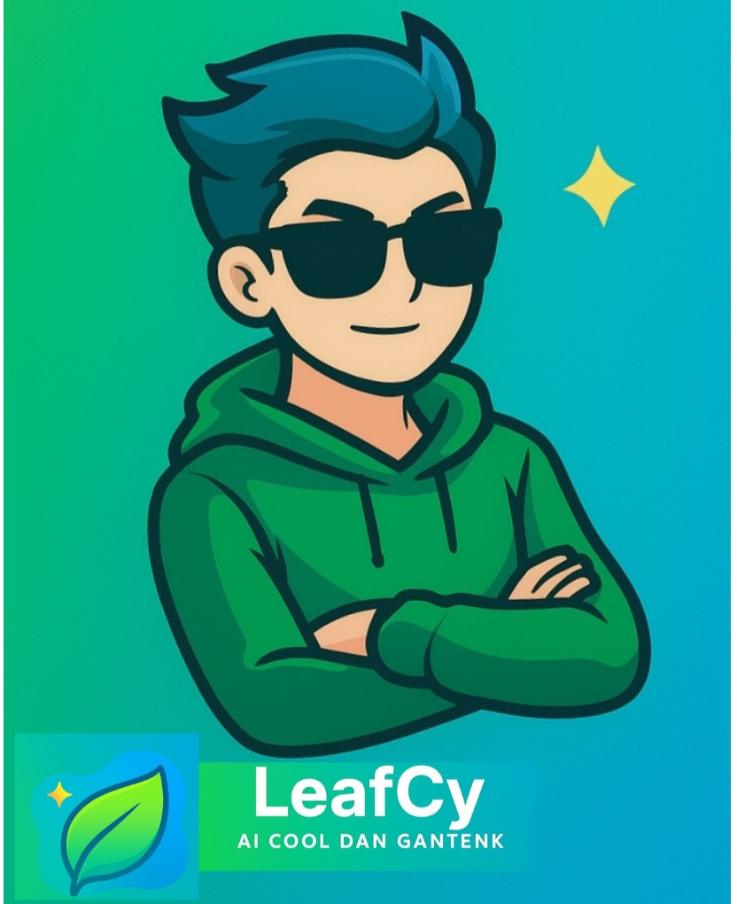

<htmllang="id">
<head>
  <metacharset="UTF-8">
  <metaname="viewport" content="width=device-width, initial-scale=1.0">
  <title>LeafCy AI — Working Edition</title>
  
</head>
<body>

  

    

      

        
      

      
🍃 LeafCy AI

      

        Halo! Aku LeafCy AI, siap ngobrol pintar 💚
      

      

        <button class="mini-btn primary" id="btnHalo">👋 Halo</button>
        <button class="mini-btn" id="btnHobi">🎨 Hobimu?</button>
        <button class="mini-btn" id="btnDance">💃 Dance</button>
        <button class="mini-btn" id="btnMalam">🌙 Good Night</button>
      

      

        💡 AI: Microsoft Phi-3 Mini (100% Gratis) | Bisa jawab apa aja!
      

    

    

      

        <h2>💬 Ngobrol dengan LeafCy AI</h2>
        

          <button class="tool-btn" id="btnClear">🧹 Clear Chat</button>
          <button class="tool-btn" id="btnTestAI">🔍 Test AI</button>
        

      

      

      

        
🍃 Halo! Aku LeafCy AI pakai Microsoft Phi-3. Coba tanya apa saja ya~

      

      

        <input type="text" id="textInput" placeholder="Contoh: Kamu tau negara Jepang?">
        <button id="btnSend">Kirim</button>
      

      

        Made with 💚 by LeafZuya · AI: Microsoft Phi-3 (OpenRouter)
      

    

  

</body>
</html>
